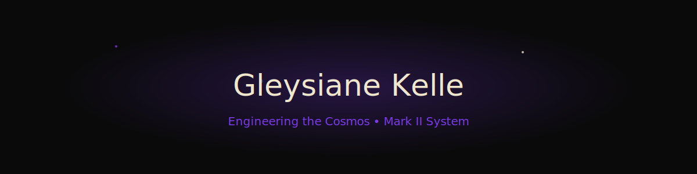
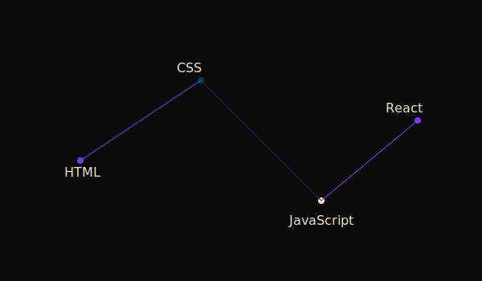

---

<p align="center">
  
</p>

---

<div align="center">


</div>

---

## 🌌 Engineering the Cosmos

Sou estudante de Engenharia de Software movida por ciência, arquitetura limpa e experiência humana.

Minha paixão por astronomia, física, ciência ambiental e mecânica influencia a forma como projeto sistemas.

Cada software é um ecossistema.
Cada interface é um ponto de contato humano.
Cada linha de código carrega intenção.

---

## 🛰 Tech Constellation



---

## 📊 Activity Nebula


---

## 🚀 Galactic Stats

<p align="center">
  
</p>

<p align="center">
  
</p>

---

## 🛸 Active Systems

### 🧠 Study Mirror
Analytics de produtividade com LocalStorage, Chart.js, Dark Mode e estrutura PWA.

### 🌍 Sexta-Feira
Monitor ambiental com estética futurista e visualização de dados.

---

<div align="center">

```diff
+ ▣ Mark II System Stable
+ ▣ Neural Engineering Core Active
+ ▣ UX Quantum Layer Operational
+ ▣ Cosmic Interface Online
